# Saved Object Diff Audit — Stress Test Results Comparison

Three server conditions tested across five matrix scripts.

| Condition | Config |
|---|---|
| **off** | Audit disabled (baseline) |
| **audit** | Audit enabled, console appender, diffs off |
| **diff** | Audit enabled + `savedObjectDiff.enabled: true`, `typesToInclude: ["index-pattern"]` |

---

## Key Findings

1. **`audit` adds no measurable overhead across all tested scenarios.** Audit and off are within noise (typically ±5–10%, no consistent direction) for individual updates, bulk updates, blob-mutating updates, bulk blob updates, and bulk gets. The audit condition is safe to enable with no performance impact.

2. **`diff` overhead is substantial and scales with pool size.** At small pools and low RPM the diff cost is ~5–15% latency overhead. Under single-batch bulk updates with large pools it becomes 2–4×, with ELU saturating at P250+.

3. **The serverless ELU ceiling (0.80) is crossed by diff at bulk P100.** At P100, off=0.508, audit=0.496 (within noise of off), diff=0.823. At P250+ all three conditions saturate from write volume; diff latency blows out further due to the mget before-state fetch being serialised with diff computation.

4. **Bulk blob diff overhead scales with object count and blob field count.** At B6 (17 objects × 10 blob fields, 60 RPM), off=2,178ms → audit=2,010ms → diff=3,563ms. Audit is within noise of off. Diff saturates ELU to 1.0.

5. **Bulk get performance is condition-agnostic at all non-saturated levels.** G1–G3 are within noise across all conditions. G4 all conditions are near-saturated (ELU 0.91–1.0) with similar latency. G5 is too unstable to draw conclusions — all three saturate fully.

---

## Metrics

| Metric | Meaning |
|---|---|
| **p50 latency** | Median request round-trip time in milliseconds. Half of all requests completed faster than this. |
| **p95 latency** | 95th-percentile latency — the slowest 5% of requests exceeded this. |
| **ELU max** | Peak Event Loop Utilisation recorded during the run (0–1). Measures how busy the Kibana Node.js event loop was. Values above **0.80** indicate the server is at or above the serverless platform ceiling and requests will queue. Values of 1.0 mean the loop was fully saturated. |
| **heap peak** | Maximum V8 heap usage recorded during the run in MB. |
| **errors** | Count of non-200 HTTP responses (429, 502, 503) or client-side timeouts during the load phase. |

**Note on sparse p95 latency charts:** The p95 latency subplot in each time-series chart shows the rolling window p95 — the 95th-percentile latency of all requests that completed within each ~5 s polling interval. At low request rates (3 RPM = one request every 20 s, 10 RPM = one every 6 s) most polling windows contain no completed requests, so the p95 reads as 0 and the line hugs the x-axis between spikes. This is expected behaviour, not missing data — the spikes are the actual latency observations.

---

## Aggregations

### p50 latency and ELU max per level

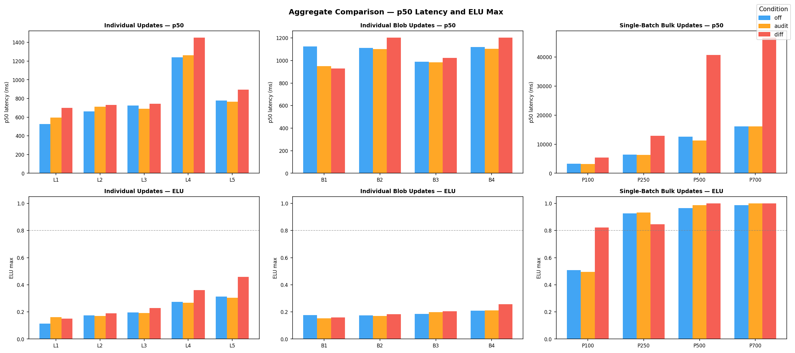

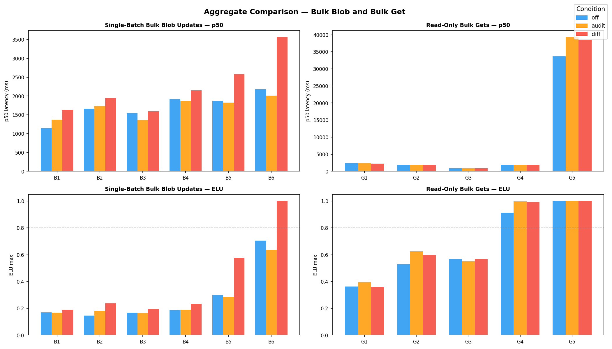

### Heap peak per level

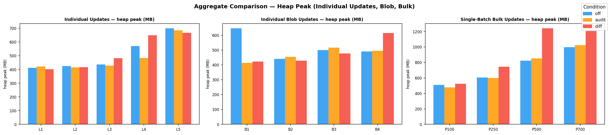

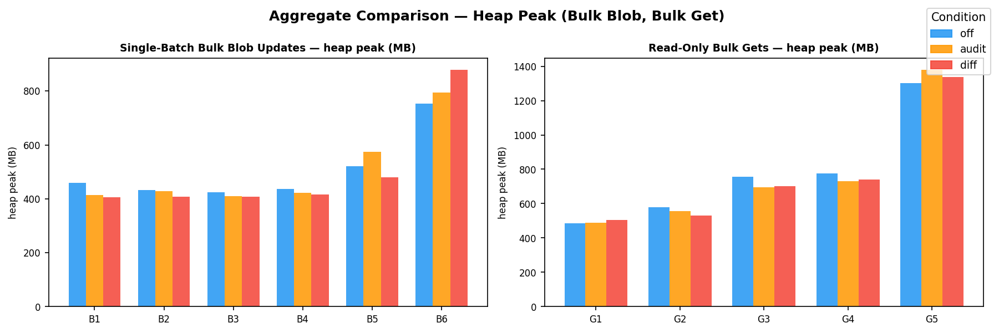

---

## run_matrix.sh — Individual Updates

Simulates a realistic mix of saved object operations — creates, updates, and deletes — fired one at a time. Closest approximation to normal Kibana usage. off and audit are within noise (±7%, no consistent direction) across all levels. diff adds ~10–17% latency, growing in ELU with load.

### L1 — baseline: 20 RPM, pool=5

Seeds 5 objects with 200 panels each. Sends 20 mixed create/update/delete requests per minute (one every 3 s). Each update writes a randomly sampled subset of properties.

| Metric | off | audit | diff |
|---|---|---|---|
| p50 latency | 527 ms | 597 ms | 701 ms |
| p95 latency | 1,126 ms | 1,155 ms | 1,088 ms |
| ELU max | 0.114 | 0.161 | 0.150 |
| heap peak | 412 MB | 422 MB | 403 MB |
| errors | — | — | — |
| server down | 0 | 0 | 0 |

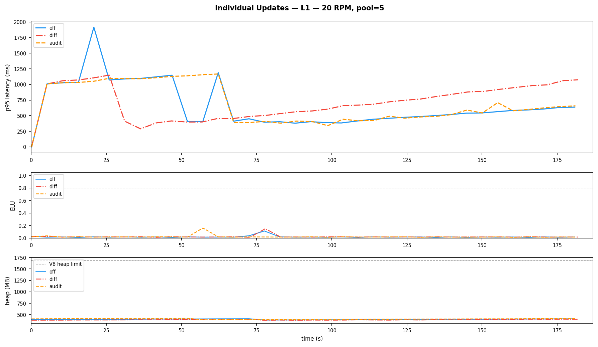

### L2 — target: 50 RPM, pool=10

Seeds 10 objects with 800 panels each. Sends 50 mixed create/update/delete requests per minute (one every 1.2 s). Each update writes a randomly sampled subset of properties. All three conditions comfortably below ELU ceiling.

| Metric | off | audit | diff |
|---|---|---|---|
| p50 latency | 662 ms | 711 ms | 731 ms |
| p95 latency | 1,142 ms | 1,144 ms | 1,167 ms |
| ELU max | 0.175 | 0.171 | 0.189 |
| heap peak | 425 MB | 416 MB | 417 MB |
| errors | — | — | — |
| server down | 0 | 0 | 0 |

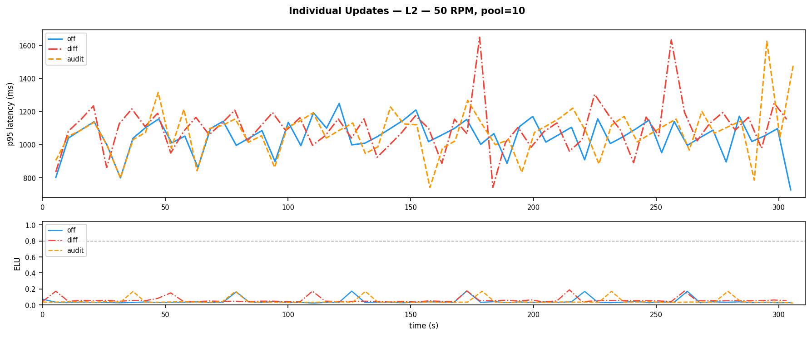

### L3 — heavy: 100 RPM, pool=10

Seeds 10 objects with 800 panels each. Sends 100 mixed create/update/delete requests per minute (one every 600 ms). Same update shape as L2 at double the rate. Diff ELU begins to diverge (+0.034 vs off).

| Metric | off | audit | diff |
|---|---|---|---|
| p50 latency | 725 ms | 690 ms | 745 ms |
| p95 latency | 1,171 ms | 1,165 ms | 1,232 ms |
| ELU max | 0.195 | 0.192 | 0.229 |
| heap peak | 437 MB | 428 MB | 482 MB |
| errors | — | — | — |
| server down | 0 | 0 | 0 |

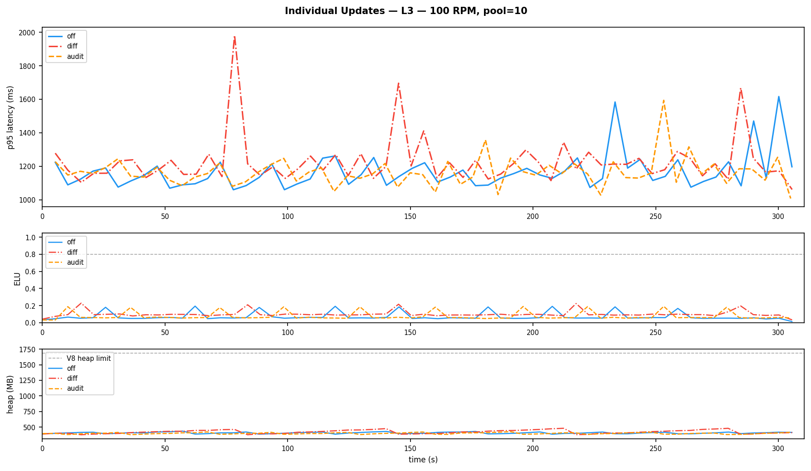

### L4 — worst shape: 100 RPM, pool=5, all-fields

Seeds 5 objects with 2000 panels each. Sends 100 requests per minute. Every update writes ALL properties on each object — maximises diff payload size. Small pool means the same objects are hit repeatedly. Highest diff ELU delta of any individual-update level (+0.085 vs off).

| Metric | off | audit | diff |
|---|---|---|---|
| p50 latency | 1,240 ms | 1,262 ms | 1,451 ms |
| p95 latency | 1,934 ms | 1,946 ms | 2,166 ms |
| ELU max | 0.275 | 0.267 | 0.360 |
| heap peak | 571 MB | 484 MB | 650 MB |
| errors | 2 | — | 2 |
| server down | 0 | 0 | 0 |

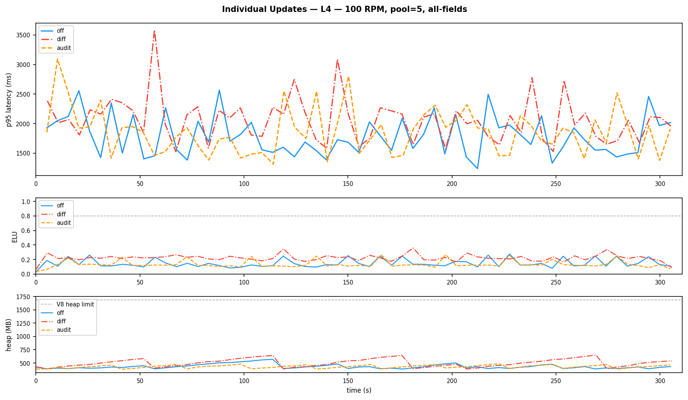

### L5 — ramp: 50→400 RPM

Seeds 10 objects with 800 panels each. Ramps: 50 RPM → 100 → 200 → 400 RPM, 2 minutes per step. Each update writes a randomly sampled subset of properties; up to 100 requests in flight simultaneously at peak. Highest diff ELU of any individual-update level (+0.146 vs off).

| Metric | off | audit | diff |
|---|---|---|---|
| p50 latency | 779 ms | 766 ms | 893 ms |
| p95 latency | 1,316 ms | 1,314 ms | 1,377 ms |
| ELU max | 0.312 | 0.304 | 0.458 |
| heap peak | 700 MB | 686 MB | 668 MB |
| errors | — | — | 1 |
| server down | 0 | 0 | 0 |

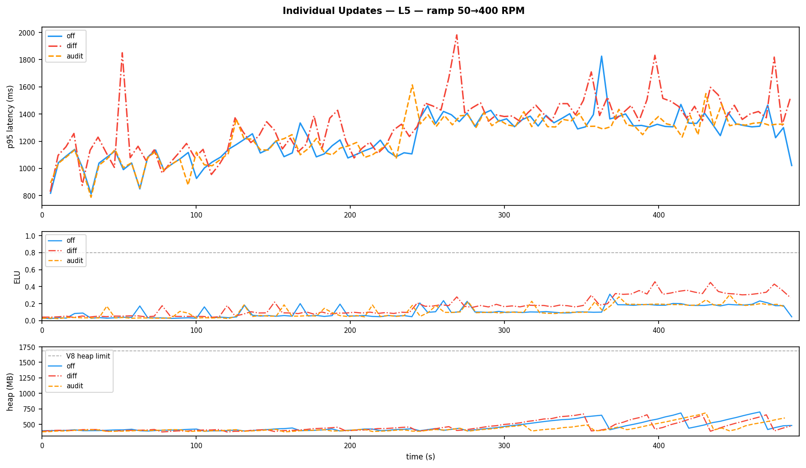

---

## run_bulk_matrix.sh — Single-Batch Bulk Updates

Every tick fires a single `_bulk_update` covering the entire pool. Before writing, the diff engine fetches current state of every object via one mget — this before-state fetch serialises with diff computation and is the dominant cost. Pool size is the primary driver. off and audit are within noise at all levels.

### P100 — pool=100

Seeds 100 objects with 800 panels each. Sends 3 bulk update requests per minute (one every 20 s); each request updates all 100 objects in a single `_bulk_update`. Only the title field changes per object. Diff crosses the 0.80 ELU serverless ceiling; audit ELU is indistinguishable from off.

| Metric | off | audit | diff |
|---|---|---|---|
| p50 latency | 3,319 ms | 3,134 ms | 5,436 ms (+64%) |
| p95 latency | 3,566 ms | 4,120 ms | 6,534 ms |
| ELU max | 0.508 | 0.496 | **0.823** ⚠️ |
| heap peak | 510 MB | 477 MB | 525 MB |
| errors | 0 | 0 | 0 |
| server down | 0 | 0 | 0 |

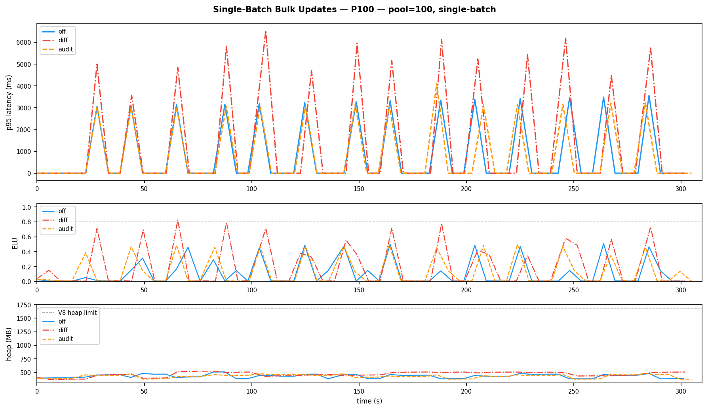

### P250 — pool=250

Seeds 250 objects with 800 panels each. Same 3 RPM; each request updates all 250 objects in a single `_bulk_update`. Off and audit begin to saturate; diff latency nearly doubles vs P100 as mget for 250 objects compounds with diff computation.

| Metric | off | audit | diff |
|---|---|---|---|
| p50 latency | 6,467 ms | 6,364 ms | 12,867 ms (+99%) |
| p95 latency | 7,207 ms | 7,271 ms | 13,761 ms |
| ELU max | 0.926 | 0.933 | 0.846 |
| heap peak | 606 MB | 599 MB | 745 MB |
| errors | 0 | 0 | 0 |
| server down | 0 | 0 | 0 |

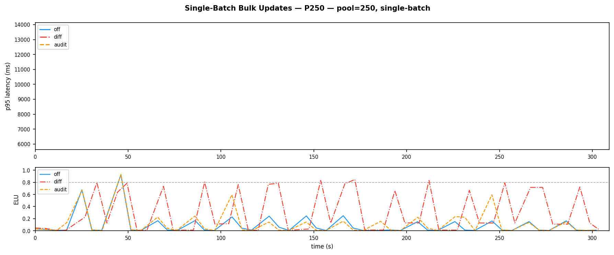

### P500 — pool=500

Seeds 500 objects with 800 panels each. Same 3 RPM; each request updates all 500 objects. Off and audit fully saturated; diff latency blows out to 40 s and the server goes down 4 times. Audit p50 appearing lower than off is variance near saturation, not a real effect.

| Metric | off | audit | diff |
|---|---|---|---|
| p50 latency | 12,581 ms | 11,270 ms | 40,739 ms (+224%) |
| p95 latency | 14,030 ms | 12,126 ms | 52,072 ms |
| ELU max | 0.965 | 0.987 | 1.000 |
| heap peak | 824 MB | 852 MB | 1,241 MB |
| errors | 0 | 0 | 3 |
| server down | 0 | 0 | **4** |

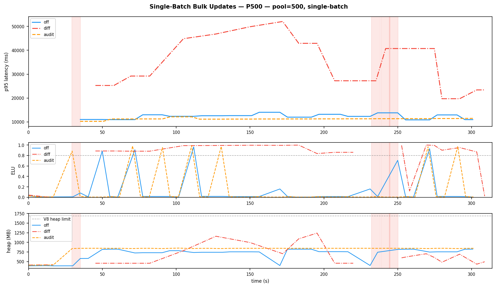

### P700 — pool=700

Seeds 700 objects with 800 panels each. Same 3 RPM; each request updates all 700 objects. All conditions saturated; diff server becomes unavailable 9× during the run.

| Metric | off | audit | diff |
|---|---|---|---|
| p50 latency | 16,084 ms | 16,140 ms | 46,687 ms (+190%) |
| p95 latency | 17,317 ms | 18,400 ms | 50,497 ms |
| ELU max | 0.988 | 1.000 | 1.000 |
| heap peak | 999 MB | 1,023 MB | 1,206 MB |
| errors | 4 | — | 4 |
| server down | **1** | **3** | **9** |

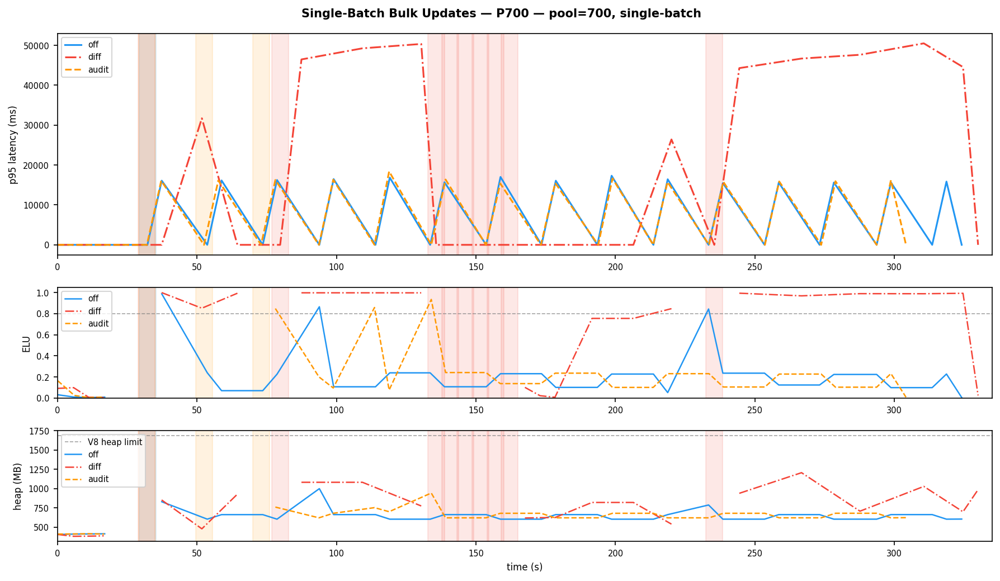

---

## run_blob_matrix.sh — Individual Blob-Mutating Updates

Targets `applyFieldSizeLimit` in the diff engine — values >48 KB are truncated before writing to the audit log. `blob0` is overwritten with new random content each tick (replace op); extra blob fields are unchanged (noOps). Isolates mget + diff compute + field size limiting on large values. off and audit within ±2% across B2–B4; diff adds ~3–8% latency, ES write latency dominates.

### B1 — pool=5, 1×50KB blob, 10 RPM

Seeds 5 objects with 1 blob field (50 KB each). Sends 10 update requests per minute (one every 6 s). Each update overwrites blob0 with new random content; no extra blob fields. Audit p50 slightly below off — noise at low RPM where fewer samples are collected.

| Metric | off | audit | diff |
|---|---|---|---|
| p50 latency | 1,125 ms | 951 ms | 930 ms |
| p95 latency | 1,465 ms | 1,609 ms | 1,451 ms |
| ELU max | 0.177 | 0.152 | 0.159 |
| heap peak | 646 MB | 413 MB | 423 MB |
| server down | 0 | 0 | 0 |

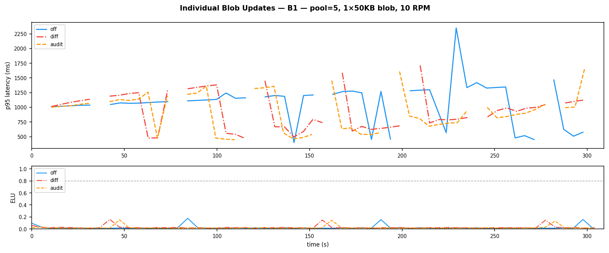

### B2 — pool=15, 2×200KB blobs, 30 RPM

Seeds 15 objects with 2 blob fields (200 KB each). Sends 30 update requests per minute (one every 2 s). Each update overwrites blob0; blob1 is unchanged (noOp). off and audit within ±1%.

| Metric | off | audit | diff |
|---|---|---|---|
| p50 latency | 1,112 ms | 1,102 ms | 1,203 ms |
| p95 latency | 1,904 ms | 1,990 ms | 2,321 ms |
| ELU max | 0.175 | 0.171 | 0.184 |
| heap peak | 441 MB | 454 MB | 428 MB |
| server down | 0 | 0 | 0 |

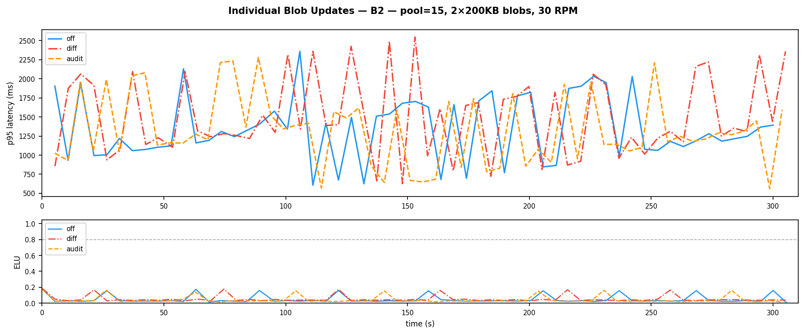

### B3 — pool=30, 4×200KB blobs, 60 RPM

Seeds 30 objects with 4 blob fields (200 KB each). Sends 60 update requests per minute (one every 1 s). Each update overwrites blob0; blob1–blob3 are unchanged (noOp). diff adds +3% latency; ES write latency dominates.

| Metric | off | audit | diff |
|---|---|---|---|
| p50 latency | 990 ms | 983 ms | 1,022 ms |
| p95 latency | 1,887 ms | 2,089 ms | 1,960 ms |
| ELU max | 0.186 | 0.198 | 0.205 |
| heap peak | 500 MB | 516 MB | 477 MB |
| server down | 0 | 0 | 0 |

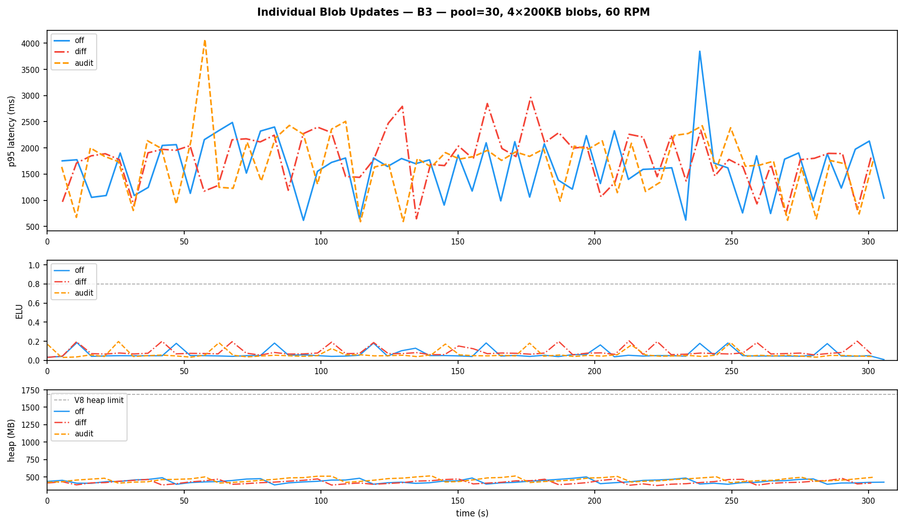

### B4 — pool=50, 4×200KB blobs, 100 RPM

Seeds 50 objects with 4 blob fields (200 KB each). Sends 100 update requests per minute (one every 600 ms). Each update overwrites blob0; blob1–blob3 are unchanged (noOp). Diff adds +8% latency and +0.047 ELU; ES write latency still dominates.

| Metric | off | audit | diff |
|---|---|---|---|
| p50 latency | 1,119 ms | 1,104 ms | 1,203 ms |
| p95 latency | 1,907 ms | 2,128 ms | 2,084 ms |
| ELU max | 0.210 | 0.211 | 0.257 |
| heap peak | 491 MB | 495 MB | 615 MB |
| server down | 0 | 0 | 0 |

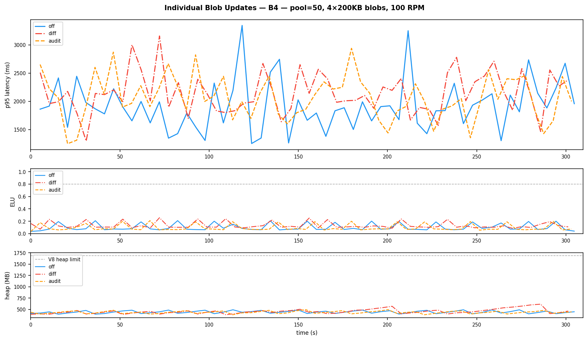

---

## run_bulk_blob_matrix.sh — Single-Batch Bulk Blob Updates

Combines bulk updates and blob fields — the two most expensive aspects of the diff feature. Every tick fires one `_bulk_update` covering the entire pool; `blob0` is mutated on every object. Pool capped at 17 (17×50KB = 850KB, near the 1 MB Kibana limit). Later levels raise blob field count and RPM to compound cost. Audit is within noise of off at all levels.

### B1 — pool=5, 1 blob, 3 RPM

Seeds 5 objects with 1 blob field (50 KB each). Sends 3 bulk update requests per minute (one every 20 s); each request updates all 5 objects in a single `_bulk_update` and overwrites blob0 with new random content. Only ~15 total requests per run — high variance. Treat p50 as directional only; ELU (0.171 vs 0.167) confirms no real audit overhead.

| Metric | off | audit | diff |
|---|---|---|---|
| p50 latency | 1,147 ms | 1,372 ms | 1,636 ms |
| p95 latency | 1,279 ms | 1,874 ms | 4,225 ms |
| ELU max | 0.171 | 0.167 | 0.189 |
| heap peak | 460 MB | 414 MB | 406 MB |
| server down | 0 | 0 | 0 |

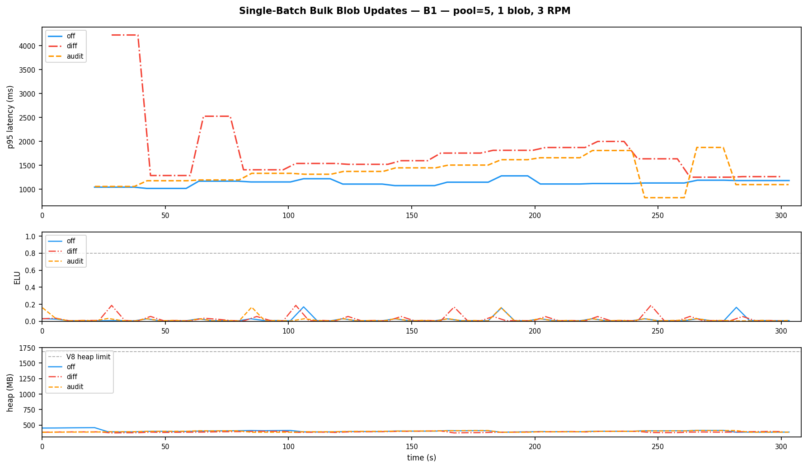

### B2 — pool=10, 1 blob, 3 RPM

Seeds 10 objects with 1 blob field (50 KB each). Sends 3 bulk update requests per minute (one every 20 s); each request updates all 10 objects in a single `_bulk_update` and overwrites blob0. Only ~15 requests per run; treat as directional.

| Metric | off | audit | diff |
|---|---|---|---|
| p50 latency | 1,665 ms | 1,736 ms | 1,952 ms |
| p95 latency | 2,546 ms | 2,690 ms | 2,400 ms |
| ELU max | 0.146 | 0.184 | 0.238 |
| heap peak | 433 MB | 429 MB | 408 MB |
| server down | 0 | 0 | 0 |

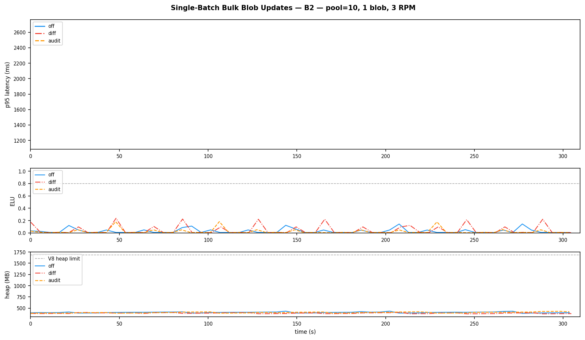

### B3 — pool=5, 3 blobs, 3 RPM

Seeds 5 objects with 3 blob fields (50 KB each). Sends 3 bulk update requests per minute; each request updates all 5 objects in a single `_bulk_update` and overwrites blob0; blob1–blob2 are unchanged (noOp). Audit within noise of off.

| Metric | off | audit | diff |
|---|---|---|---|
| p50 latency | 1,537 ms | 1,360 ms | 1,592 ms |
| p95 latency | 2,356 ms | 1,865 ms | 2,129 ms |
| ELU max | 0.168 | 0.165 | 0.194 |
| heap peak | 425 MB | 411 MB | 408 MB |
| server down | 0 | 0 | 0 |

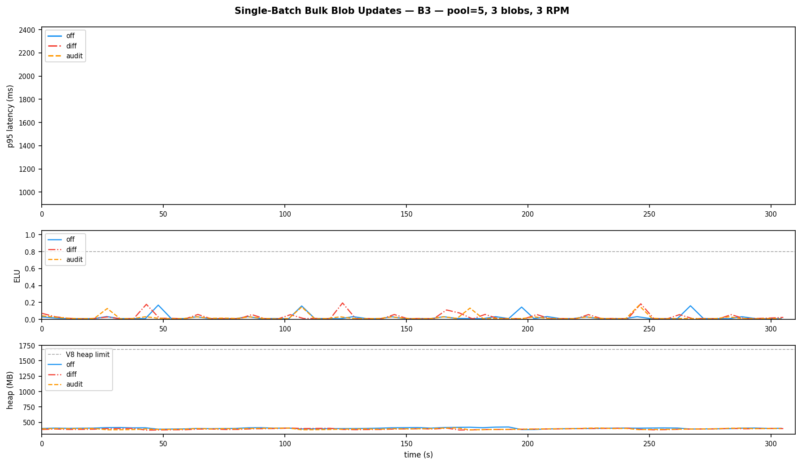

### B4 — pool=10, 3 blobs, 3 RPM

Seeds 10 objects with 3 blob fields (50 KB each). Sends 3 bulk update requests per minute; each request updates all 10 objects in a single `_bulk_update` and overwrites blob0; blob1–blob2 are unchanged (noOp). Audit within ±3% of off.

| Metric | off | audit | diff |
|---|---|---|---|
| p50 latency | 1,921 ms | 1,865 ms | 2,150 ms |
| p95 latency | 2,462 ms | 2,607 ms | 2,975 ms |
| ELU max | 0.188 | 0.190 | 0.234 |
| heap peak | 436 MB | 422 MB | 417 MB |
| server down | 0 | 0 | 0 |

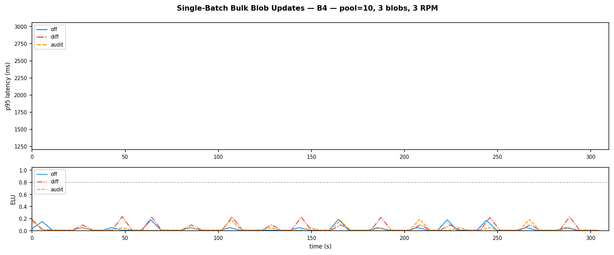

### B5 — pool=17, 5 blobs, 20 RPM

Seeds 17 objects with 5 blob fields (50 KB each). Sends 20 bulk update requests per minute (one every 3 s); each request updates all 17 objects in a single `_bulk_update` and overwrites blob0; blob1–blob4 are unchanged (noOp). Requests start overlapping. Diff ELU nearly doubles vs off (+92%).

| Metric | off | audit | diff |
|---|---|---|---|
| p50 latency | 1,876 ms | 1,829 ms | 2,579 ms |
| p95 latency | 2,403 ms | 2,557 ms | 3,431 ms |
| ELU max | 0.301 | 0.285 | **0.578** |
| heap peak | 521 MB | 574 MB | 480 MB |
| server down | 0 | 0 | 0 |

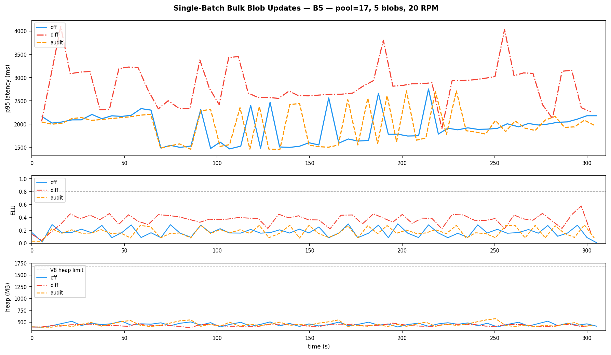

### B6 — pool=17, 10 blobs, 60 RPM

Seeds 17 objects with 10 blob fields (50 KB each). Sends 60 bulk update requests per minute (one every 1 s); each request updates all 17 objects in a single `_bulk_update` and overwrites blob0; blob1–blob9 are unchanged (noOp). 2–3 requests in flight simultaneously; 10 blob fields compound mget response size. Diff saturates ELU to 1.0.

| Metric | off | audit | diff |
|---|---|---|---|
| p50 latency | 2,178 ms | 2,010 ms | 3,563 ms |
| p95 latency | 3,243 ms | 3,068 ms | 6,560 ms |
| ELU max | 0.705 | 0.635 | **1.000** 🔴 |
| heap peak | 754 MB | 795 MB | 878 MB |
| server down | 0 | 0 | 0 |

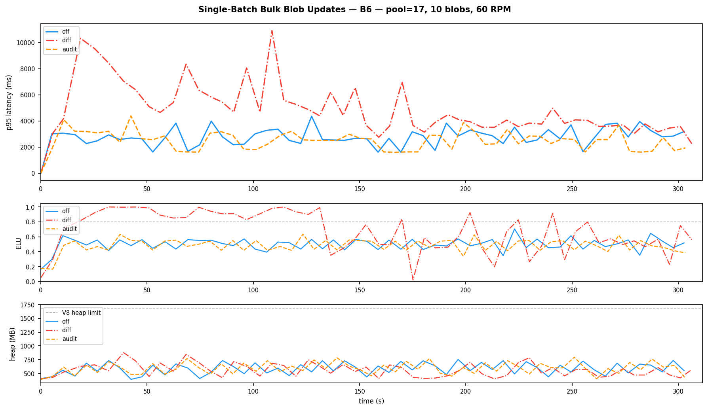

---

## run_bulk_get_matrix.sh — Read-Only Bulk Gets

Control test — fires read-only `_bulk_get` requests only. Measures the baseline cost of the mget operation the diff engine adds before every bulk update. All three conditions are essentially identical at G1–G4, confirming overhead in the bulk update tests comes from diff computation, not the mget itself.

### G1 — pool=100, 10 RPM

Seeds 100 objects with 800 panels each. Fires one read-only `_bulk_get` covering all 100 objects every 6 s (10 RPM). Low concurrency; all three conditions within ±4%.

| Metric | off | audit | diff |
|---|---|---|---|
| p50 latency | 2,347 ms | 2,385 ms | 2,290 ms |
| p95 latency | 2,696 ms | 2,765 ms | 2,756 ms |
| ELU max | 0.363 | 0.395 | 0.358 |
| heap peak | 486 MB | 487 MB | 504 MB |
| errors | 0 | 0 | 0 |
| server down | 0 | 0 | 0 |

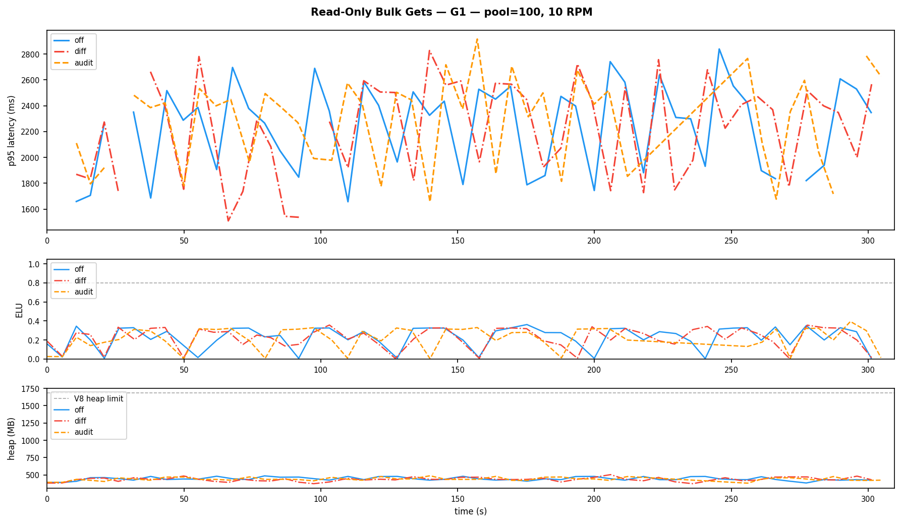

### G2 — pool=100, 20 RPM

Seeds 100 objects with 800 panels each. Fires one read-only `_bulk_get` covering all 100 objects every 3 s (20 RPM). Requests begin overlapping. All conditions within ±8%.

| Metric | off | audit | diff |
|---|---|---|---|
| p50 latency | 1,816 ms | 1,806 ms | 1,831 ms |
| p95 latency | 2,525 ms | 2,453 ms | 2,492 ms |
| ELU max | 0.529 | 0.626 | 0.599 |
| heap peak | 578 MB | 555 MB | 529 MB |
| errors | 0 | 0 | 0 |
| server down | 0 | 0 | 0 |

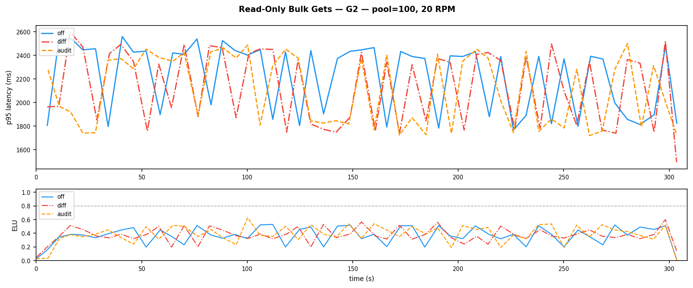

### G3 — pool=50, 50 RPM

Seeds 50 objects with 800 panels each. Fires one read-only `_bulk_get` covering all 50 objects every 1.2 s (50 RPM). High concurrency, smaller payload per request. All three conditions essentially identical.

| Metric | off | audit | diff |
|---|---|---|---|
| p50 latency | 909 ms | 925 ms | 929 ms |
| p95 latency | 1,631 ms | 1,658 ms | 1,680 ms |
| ELU max | 0.568 | 0.551 | 0.566 |
| heap peak | 756 MB | 695 MB | 700 MB |
| errors | 0 | 0 | 0 |
| server down | 0 | 0 | 0 |

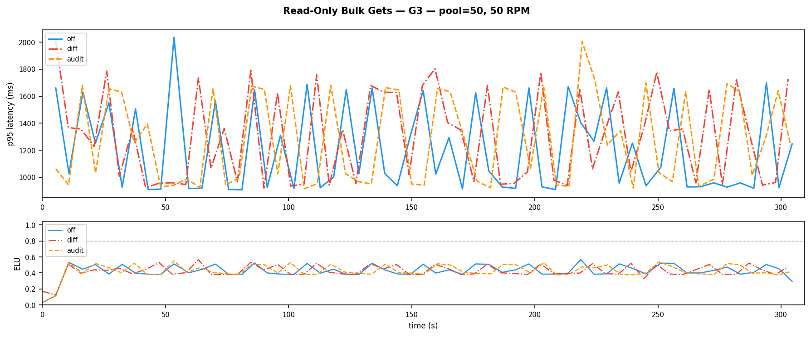

### G4 — pool=100, 50 RPM

Seeds 100 objects with 800 panels each. Fires one read-only `_bulk_get` covering all 100 objects every 1.2 s (50 RPM). All conditions near-saturated; latency within ±3% across conditions. ELU variance at saturation is noise, not real overhead from audit or diff.

| Metric | off | audit | diff |
|---|---|---|---|
| p50 latency | 1,867 ms | 1,913 ms | 1,891 ms |
| p95 latency | 3,166 ms | 3,781 ms | 3,621 ms |
| ELU max | 0.914 | 0.998 | 0.991 |
| heap peak | 777 MB | 732 MB | 739 MB |
| errors | 0 | 0 | 0 |
| server down | 0 | 0 | 0 |

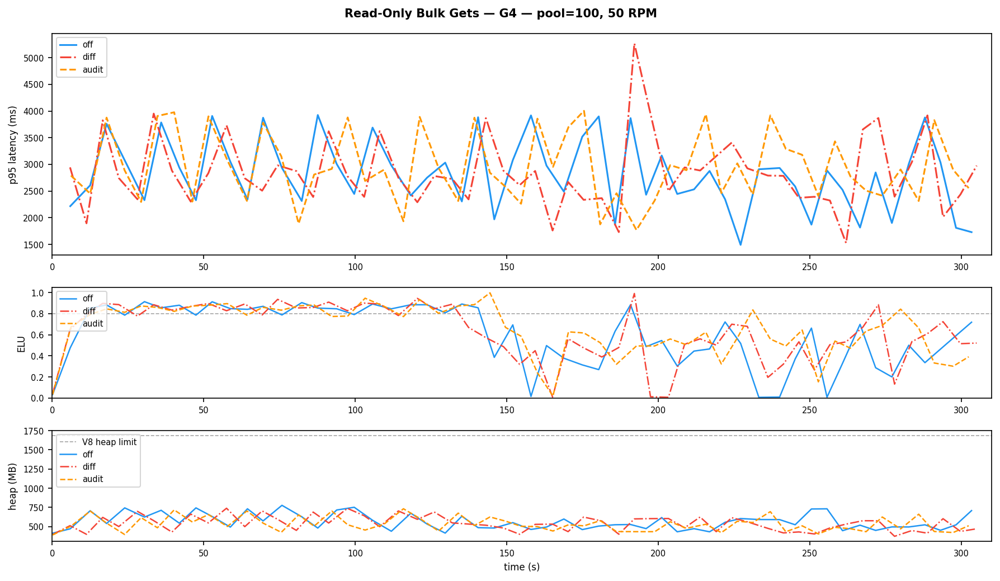

### G5 — pool=250, 50 RPM (saturated)

Seeds 250 objects with 800 panels each. Fires one read-only `_bulk_get` covering all 250 objects every 1.2 s (50 RPM). All three conditions fully saturate. Results dominated by server chaos; not comparable across conditions.

| Metric | off | audit | diff |
|---|---|---|---|
| p50 latency | 33,653 ms | 39,271 ms | 38,487 ms |
| p95 latency | 52,626 ms | 55,096 ms | 54,297 ms |
| ELU max | 1.000 | 1.000 | 1.000 |
| heap peak | 1,301 MB | 1,378 MB | 1,338 MB |
| errors | 61 | 129 | 115 |
| server down | **1** | **12** | **5** |

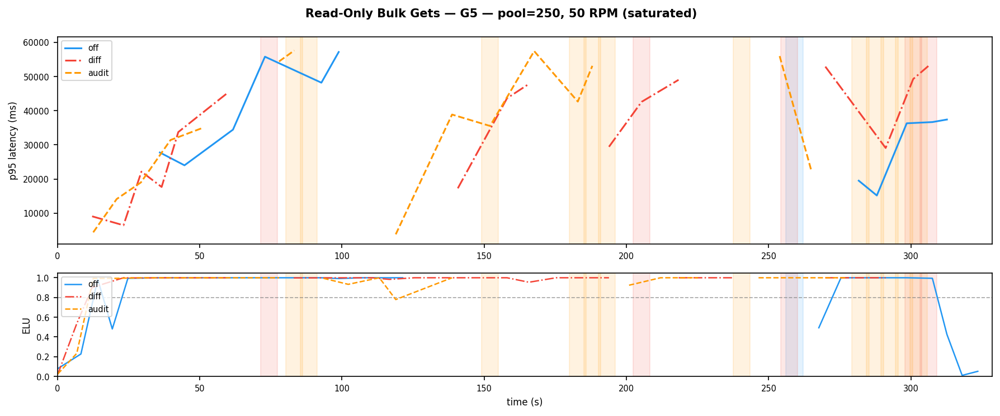

---

## Overhead Summary

### audit vs off

| Scenario | Overhead | Detail |
|---|---|---|
| Individual updates (L1–L5) | None | Within ±7%, no consistent direction |
| Individual blob updates (B1–B4) | None | Within ±2% at B2–B4; B1 audit slightly lower than off (noise at 10 RPM) |
| Bulk updates (P100–P700) | None | Latency and ELU within noise of off at all pool sizes |
| Bulk blob B3–B6 | None | Audit within ±5% of off; trending slightly lower, no consistent overhead |
| Bulk blob B1–B2 | None (likely) | Only ~15 requests per run; B1 +20% latency is high-variance noise (ELU identical) |
| Bulk get (G1–G5) | None | Gets don't trigger audit events; all conditions identical |

### diff vs off

| Scenario | Overhead | Detail |
|---|---|---|
| Individual updates (L1–L5) | Mild | +10–17% latency, +4–15% ELU; grows with load |
| Individual blob updates (B1–B4) | Mild | +5–8% latency, +0.05 ELU at B4 |
| Bulk P100 | **Significant** | +64% latency; ELU 0.823, crosses serverless 0.80 ceiling |
| Bulk P250+ | **Severe** | 2–4× latency; ELU saturates; mget + compute serialisation at scale |
| Bulk blob B5 | **Moderate** | ELU 0.578 vs 0.301 (+92%) |
| Bulk blob B6 | **Severe** | ELU 1.000; +64% latency vs off |
| Bulk get (any level) | None | Gets don't trigger diff computation |
