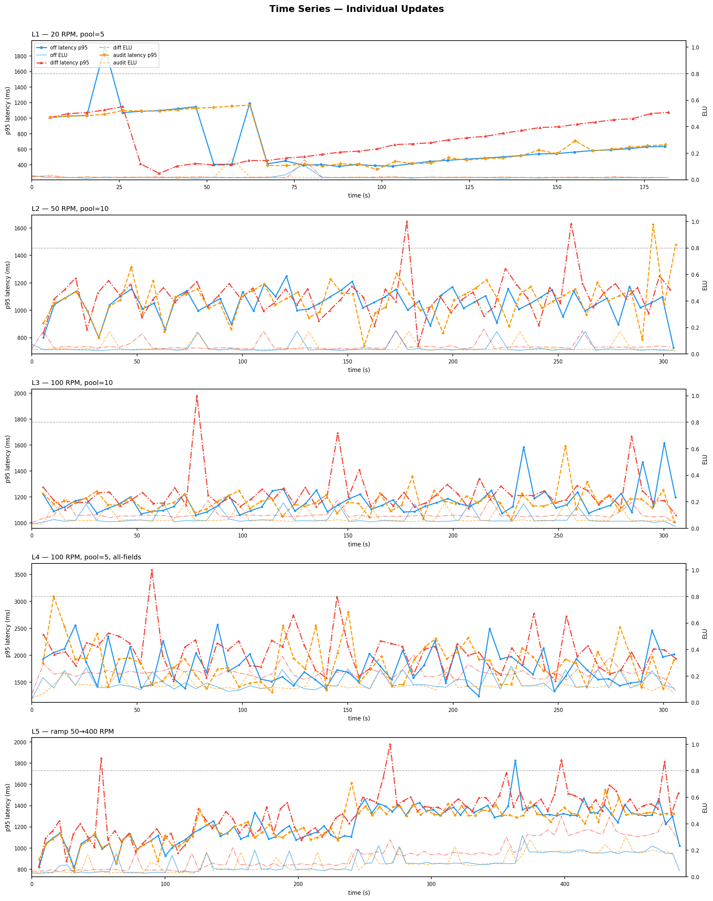
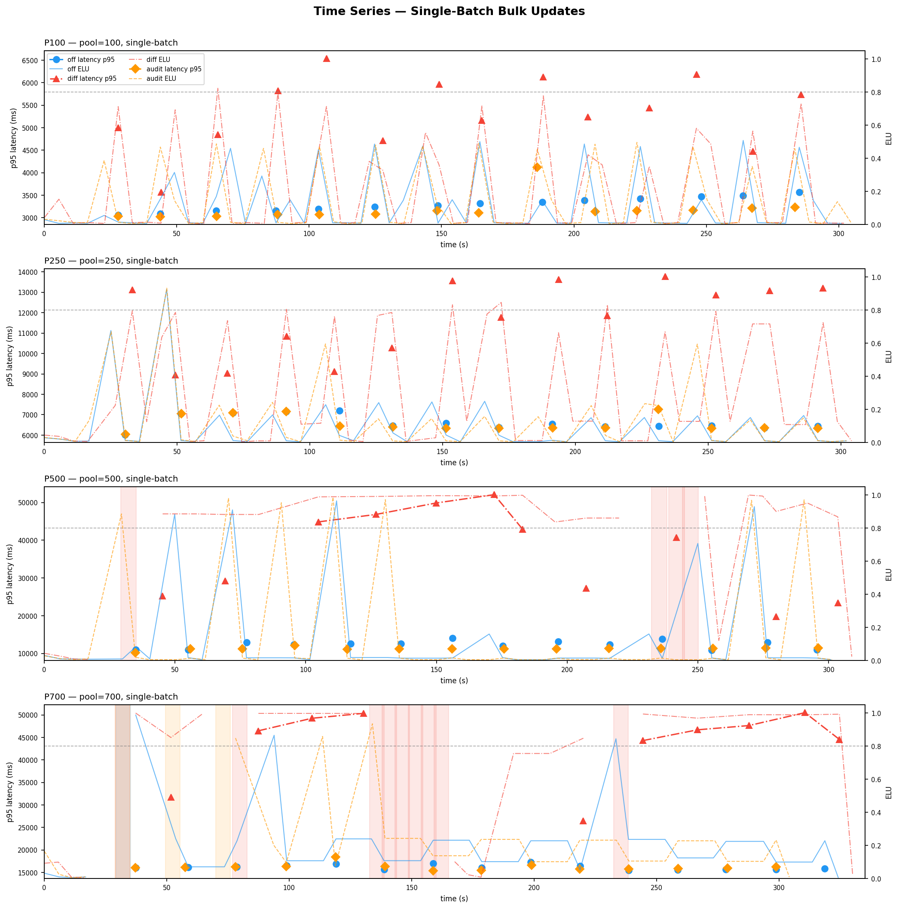
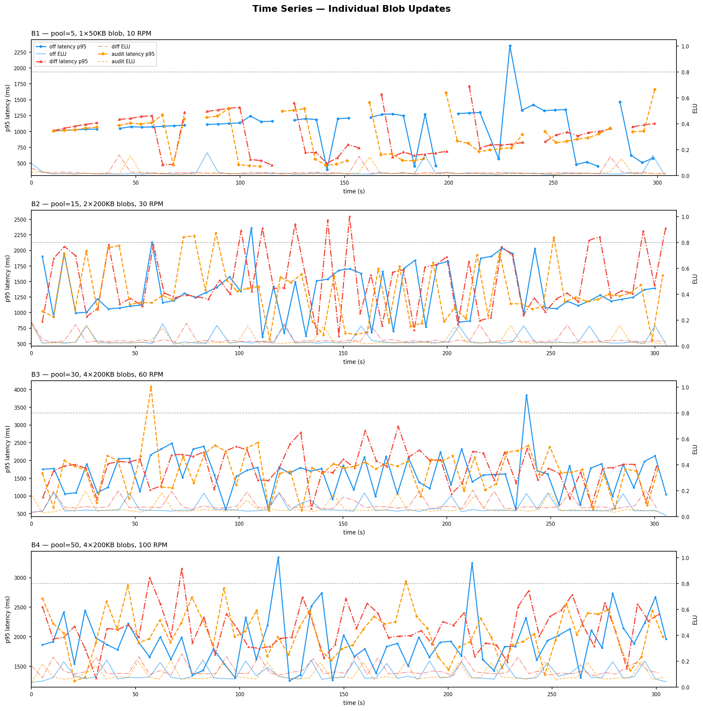
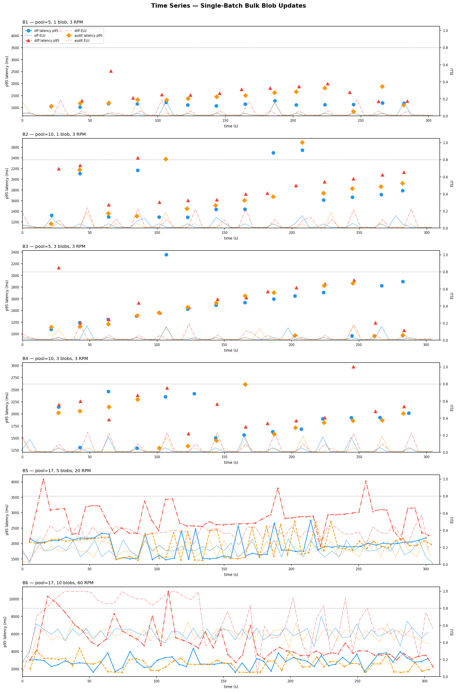
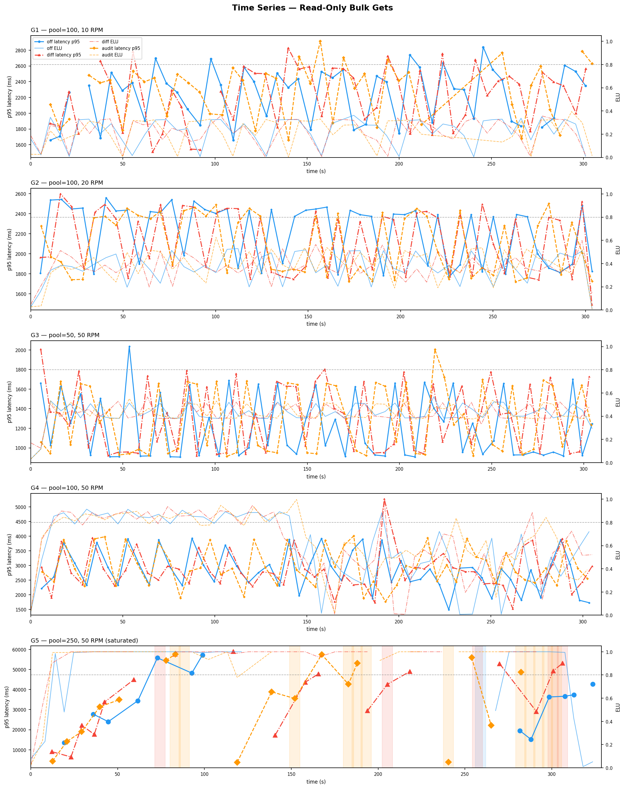

# Saved Object Diff Audit — Stress Test Results Comparison

Three server conditions tested across five matrix scripts.

| Condition | Config |
|---|---|
| **off** | Audit disabled (baseline) |
| **audit** | Audit enabled, console appender, diffs off |
| **diff** | Audit enabled + `savedObjectDiff.enabled: true`, `typesToInclude: ["index-pattern"]` |

---

## Key Findings

1. **`audit` adds no measurable overhead across all tested scenarios.** Audit and off are within noise (typically ±5–10%, no consistent direction) for individual updates, bulk updates, blob-mutating updates, bulk blob updates, and bulk gets. The audit condition is safe to enable with no performance impact.

2. **`diff` overhead is substantial and scales with pool size.** At small pools and low RPM the diff cost is ~5–15% latency overhead. Under single-batch bulk updates with large pools it becomes 2–4×, with ELU saturating at P250+.

3. **The serverless ELU ceiling (0.80) is crossed by diff at bulk P100.** At P100, off=0.508, audit=0.496 (within noise of off), diff=0.823. At P250+ all three conditions saturate from write volume; diff latency blows out further due to the mget before-state fetch being serialised with diff computation.

4. **Bulk blob diff overhead scales with object count and blob field count.** At B6 (17 objects × 10 blob fields, 60 RPM), off=2,178ms → audit=2,010ms → diff=3,563ms. Audit is within noise of off. Diff saturates ELU to 1.0.

5. **Bulk get performance is condition-agnostic at all non-saturated levels.** G1–G3 are within noise across all conditions. G4 all conditions are near-saturated (ELU 0.91–1.0) with similar latency. G5 is too unstable to draw conclusions — all three saturate fully.

---

## Testing Methodology

### What is being tested

The feature under test is `xpack.security.audit.savedObjectDiff` — a Kibana server-side feature that, when enabled, computes a field-level JSON diff of saved object state before and after every update and appends it to the audit log. The goal of this test is to measure the performance overhead of that feature under a variety of load shapes.

### The stress test tool

All tests use `so_diff_stress.js`, a Node.js script that drives load against a live Kibana instance over HTTP. It seeds a pool of `index-pattern` saved objects, then fires requests at a controlled rate and records latency and server health metrics from Kibana's status API.

### Server conditions

Each matrix was run three times — once per condition. The server config was changed by modifying `config/serverless.yml` and redeploying the PR Docker image to the QA serverless environment between runs.

| Condition | What changed |
|---|---|
| **off** | `xpack.security.audit.enabled: false` — no audit logging at all, used as the performance baseline |
| **audit** | Audit enabled with a console appender; `savedObjectDiff` not configured — audit events are written but no diffs are computed |
| **diff** | Same as audit, plus `savedObjectDiff.enabled: true` and `typesToInclude: ["index-pattern"]` — diffs are computed and included in audit events |

Comparing off→audit isolates the cost of audit event writes. Comparing audit→diff isolates the cost of diff computation itself.

### Key parameters

| Parameter | What it controls |
|---|---|
| `--pool N` | Number of saved objects seeded before the run. Requests are drawn from this pool. |
| `--rpm N` | Target request rate in requests per minute. The tool fires one tick every `60000/rpm` ms. |
| `--duration N` | How long the load phase runs in seconds (all runs use 300s = 5 minutes). |
| `--single-batch` | Each tick sends one request covering the **entire pool** rather than picking random objects. Used for bulk tests to maximise objects per request. |
| `--bulk` | Uses the `_bulk_update` API (multiple objects per request). Without this flag, individual `update` calls are made. `--single-batch` implies bulk. |
| `--update-mode blob` | On every tick, mutates one blob field (`blob0`) so the diff engine always sees a **replace op** — exercises the `applyFieldSizeLimit` path that truncates large field values in the audit log. |
| `--update-mode get` | Instead of updating, fires `_bulk_get` requests — read-only, used to measure the baseline cost of mget operations (the same ES call the diff engine makes to fetch before-state). |
| `--blob-fields N` | Number of large binary fields (`blob0`…`blobN-1`) attached to each object at seed time. Extra blob fields beyond `blob0` are unchanged each tick, so they appear as noOps in the diff. |
| `--blob-size N` | Size of each blob field in bytes (e.g. `51200` = 50 KB, `204800` = 200 KB). The diff engine's `applyFieldSizeLimit` truncates field values larger than 48 KB in the audit log. |
| `--panels N` | Number of nested panel objects inside each saved object's attributes. Controls object complexity for non-blob tests. |

### What each matrix tests

| Script | Update type | Objects/request | Purpose |
|---|---|---|---|
| `run_matrix.sh` (L1–L5) | Individual `_update` | 1 | Baseline overhead at realistic per-object update rates; mixed create/update/delete |
| `run_bulk_matrix.sh` (P100–P700) | `_bulk_update`, full pool | 100–700 | Measures diff cost under the most demanding scenario: one request updating hundreds of objects simultaneously |
| `run_blob_matrix.sh` (B1–B4) | Individual `_update` | 1 | Adds large blob fields; blob0 mutated every tick to trigger `applyFieldSizeLimit` on each update |
| `run_bulk_blob_matrix.sh` (B1–B6) | `_bulk_update`, full pool | 5–17 | Combines bulk + blobs; measures compounding cost of mget + diff compute + field size limiting at concurrency |
| `run_bulk_get_matrix.sh` (G1–G5) | `_bulk_get` (read-only) | 50–250 | Measures raw mget cost; since diff adds one mget per bulk update to fetch before-state, this establishes the baseline cost of that operation |

### Metrics

| Metric | Meaning |
|---|---|
| **p50 latency** | Median request round-trip time in milliseconds. Half of all requests completed faster than this. |
| **p95 latency** | 95th-percentile latency — the slowest 5% of requests exceeded this. |
| **ELU max** | Peak Event Loop Utilisation recorded during the run (0–1). Measures how busy the Kibana Node.js event loop was. Values above **0.80** indicate the server is at or above the serverless platform ceiling and requests will queue. Values of 1.0 mean the loop was fully saturated. |
| **errors** | Count of non-200 HTTP responses (429, 502, 503) or client-side timeouts during the load phase. |

### Caveats

- The three conditions were run at different times against the same QA serverless deployment. Server performance can vary between runs due to background activity, garbage collection, or ES cluster state — this adds noise, particularly in tests that push the server into saturation.
- Bulk blob B1 and B2 run at 3 RPM for 300s, producing only ~15 total requests each. p50 from 15 samples has high variance; treat those rows as directional rather than precise.
- G5 (250 objects, 50 RPM bulk get) fully saturates all three conditions and is excluded from the bulk get chart. Results at that level are dominated by server chaos rather than the feature under test.

---

## Charts

### Aggregate comparison (p50 latency and ELU max per level)

---

## run_matrix.sh — Individual Updates

This script simulates a realistic mix of saved object operations — creates, updates, and deletes — fired one at a time. Each request targets a single object from the pool. It is the closest approximation to normal Kibana usage patterns, where a user saves a dashboard or modifies a visualization.

Five load levels progressively increase RPM and pool size. L4 specifically uses a small pool with complex objects (2000 panels, all fields updated) to maximize the per-object diff cost. L5 is a ramp test that starts at 50 RPM and doubles every 60 seconds up to 400 RPM, revealing how the server degrades as load increases over time.

| Level | Shape | off p50 | audit p50 | diff p50 | off ELU | audit ELU | diff ELU | errors | server down (polls) |
|---|---|---|---|---|---|---|---|---|---|
| L1 baseline | 20 RPM, pool=5 | 527 ms | 597 ms | 701 ms | 0.114 | 0.161 | 0.150 | — | 0 / 0 / 0 |
| L2 target | 50 RPM, pool=10 | 662 ms | 711 ms | 731 ms | 0.175 | 0.171 | 0.189 | — | 0 / 0 / 0 |
| L3 heavy | 100 RPM, pool=10 | 725 ms | 690 ms | 745 ms | 0.195 | 0.192 | 0.229 | — | 0 / 0 / 0 |
| L4 worst shape | 100 RPM, pool=5, all-fields | 1,240 ms | 1,262 ms | 1,451 ms | 0.275 | 0.267 | 0.360 | off:2, dif:2 | 0 / 0 / 0 |
| L5 ramp | 50→400 RPM | 779 ms | 766 ms | 893 ms | 0.312 | 0.304 | 0.458 | dif:1 | 0 / 0 / 0 |

- off and audit track within ±7% across all levels with no consistent direction — within noise.
- diff adds ~10–17% latency and grows in ELU with load (+0.085 at L4, +0.146 at L5).

### Time-series

---

## run_bulk_matrix.sh — Single-Batch Bulk Updates

This script represents the worst-case scenario for the diff feature: every tick fires a single `_bulk_update` request that updates every object in the pool simultaneously. In Kibana this maps to operations like saving a space with many shared objects, or a migration that bulk-writes hundreds of saved objects in one call.

The critical difference for diff is that before writing, the server must fetch the current state of every object in the pool via a single `_bulk_get` to ES — this is the "before-state" needed to compute the diff. At pool=100 that is one mget for 100 documents, at pool=700 it is one mget for 700 documents, all before any diff computation begins. Pool size is the primary driver of cost here.

| Pool | off p50 | audit p50 | diff p50 | diff overhead | off ELU | audit ELU | diff ELU | diff errors | server down off/aud/dif |
|---|---|---|---|---|---|---|---|---|---|
| P100 | 3,319 ms | 3,134 ms | 5,436 ms | +64% | 0.508 | 0.496 | **0.823** ⚠️ | 0 | 0 / 0 / 0 |
| P250 | 6,467 ms | 6,364 ms | 12,867 ms | +99% | 0.926 | 0.933 | 0.846 | 0 | 0 / 0 / 0 |
| P500 | 12,581 ms | 11,270 ms | 40,739 ms | +224% | 0.965 | 0.987 | 1.000 | 3 | 0 / 0 / **4** |
| P700 | 16,084 ms | 16,140 ms | 46,687 ms | +190% | 0.988 | 1.000 | 1.000 | 4 | **1** / **3** / **9** |

- **P100**: diff crosses the 0.80 ELU ceiling (0.823). Audit ELU (0.496) is indistinguishable from off (0.508).
- **P250–P700**: off and audit have nearly identical latency across all four levels. Diff latency is 2–4× due to the mget before-state fetch for all N objects being serialised with diff compute.
- P500 audit p50 (11,270ms) appears lower than off (12,581ms) — variance near saturation, not a real effect.

### Time-series

---

## run_blob_matrix.sh — Individual Blob-Mutating Updates

This script targets a specific code path in the diff engine: `applyFieldSizeLimit`. When a field value in the diff exceeds 48 KB, the engine must truncate it before writing to the audit log. This path only runs on fields that actually changed (replace ops), not on unchanged fields (noOps).

Each object is seeded with large blob fields. On every tick, `blob0` is overwritten with new random content, guaranteeing the diff always sees a replace op and always triggers `applyFieldSizeLimit` for that field. The remaining blob fields are unchanged, so they appear as noOps — their cost is just a string comparison. This isolates the combined cost of: mget before-state fetch + diff computation + field size limiting on large values.

| Level | Shape | off p50 | audit p50 | diff p50 | off ELU | audit ELU | diff ELU | server down off/aud/dif |
|---|---|---|---|---|---|---|---|---|
| B1 | pool=5, 1×50KB blob, 10 RPM | 1,125 ms | 951 ms | 930 ms | 0.177 | 0.152 | 0.159 | 0 / 0 / 0 |
| B2 | pool=15, 2×200KB blobs, 30 RPM | 1,112 ms | 1,102 ms | 1,203 ms | 0.175 | 0.171 | 0.184 | 0 / 0 / 0 |
| B3 | pool=30, 4×200KB blobs, 60 RPM | 990 ms | 983 ms | 1,022 ms | 0.186 | 0.198 | 0.205 | 0 / 0 / 0 |
| B4 | pool=50, 4×200KB blobs, 100 RPM | 1,119 ms | 1,104 ms | 1,203 ms | 0.210 | 0.211 | 0.257 | 0 / 0 / 0 |

- off and audit within ±2% across B2–B4. B1 audit (951ms) is slightly lower than off (1,125ms) — noise at 10 RPM where fewer total samples are collected.
- diff adds ~3–8% latency and a small ELU bump (+0.047 at B4). ES write latency dominates.

### Time-series

---

## run_bulk_blob_matrix.sh — Single-Batch Bulk Blob Updates

This script combines the two most expensive aspects of the diff feature: bulk updates (all objects in one request) and blob fields (large values that trigger `applyFieldSizeLimit`). Every tick fires one `_bulk_update` covering the entire pool, and `blob0` is mutated on every object every tick.

The pool is capped at 17 objects because the Kibana request size limit is ~1 MB — at 50 KB per blob, 17 objects × 50 KB = 850 KB, which is the largest safe payload. The later levels (B5, B6) increase the number of blob fields per object to raise the mget response size and the number of `applyFieldSizeLimit` calls per request, and increase RPM to put multiple requests in flight simultaneously.

| Level | Shape | off p50 | audit p50 | diff p50 | off ELU | audit ELU | diff ELU | server down off/aud/dif |
|---|---|---|---|---|---|---|---|---|
| B1 | pool=5, 1 blob, 3 RPM | 1,147 ms | 1,372 ms | 1,636 ms | 0.171 | 0.167 | 0.189 | 0 / 0 / 0 |
| B2 | pool=10, 1 blob, 3 RPM | 1,665 ms | 1,736 ms | 1,952 ms | 0.146 | 0.184 | 0.238 | 0 / 0 / 0 |
| B3 | pool=5, 3 blobs, 3 RPM | 1,537 ms | 1,360 ms | 1,592 ms | 0.168 | 0.165 | 0.194 | 0 / 0 / 0 |
| B4 | pool=10, 3 blobs, 3 RPM | 1,921 ms | 1,865 ms | 2,150 ms | 0.188 | 0.190 | 0.234 | 0 / 0 / 0 |
| B5 | pool=17, 5 blobs, 20 RPM | 1,876 ms | 1,829 ms | 2,579 ms | 0.301 | 0.285 | **0.578** | 0 / 0 / 0 |
| B6 | pool=17, 10 blobs, 60 RPM | 2,178 ms | 2,010 ms | 3,563 ms | 0.705 | 0.635 | **1.000** 🔴 | 0 / 0 / 0 |

- **B1 and B2** run at 3 RPM, producing only ~15 requests per 300s run. p50 from 15 samples has high variance — B1 audit (+20% vs off) and B2 audit (+4%) should be treated as directional. B1 ELU is essentially the same (0.171 vs 0.167), consistent with no real overhead.
- **B3–B6**: audit is within noise of off (trending slightly lower at B3–B6), consistent with all other matrices.
- **diff**: moderate overhead at B3/B4 (+4–12%), growing to severe at B5 (ELU +92%) and B6 (ELU 1.0, +64% latency).

### Time-series

---

## run_bulk_get_matrix.sh — Read-Only Bulk Gets

This script is a control test, not a feature test. It fires read-only `_bulk_get` requests and never writes anything. Its purpose is to measure the baseline cost of the mget operation itself — the same ES call the diff engine performs before every bulk update to fetch the before-state of all objects being modified.

By comparing off, audit, and diff on read-only gets, we can confirm that the diff engine's mget adds no overhead to the read path (it only runs during writes), and establish what a "free" mget actually costs at different pool sizes. If all three conditions are identical here (which they are for G1–G4), it confirms the overhead seen in the bulk update tests is from diff computation, not the mget itself.

| Level | Shape | off p50 | audit p50 | diff p50 | off ELU | audit ELU | diff ELU | errors off/aud/dif | server down off/aud/dif |
|---|---|---|---|---|---|---|---|---|---|
| G1 | pool=100, 10 RPM | 2,347 ms | 2,385 ms | 2,290 ms | 0.363 | 0.395 | 0.358 | 0 / 0 / 0 | 0 / 0 / 0 |
| G2 | pool=100, 20 RPM | 1,816 ms | 1,806 ms | 1,831 ms | 0.529 | 0.626 | 0.599 | 0 / 0 / 0 | 0 / 0 / 0 |
| G3 | pool=50, 50 RPM | 909 ms | 925 ms | 929 ms | 0.568 | 0.551 | 0.566 | 0 / 0 / 0 | 0 / 0 / 0 |
| G4 | pool=100, 50 RPM | 1,867 ms | 1,913 ms | 1,891 ms | 0.914 | 0.998 | 0.991 | 0 / 0 / 0 | 0 / 0 / 0 |
| G5 | pool=250, 50 RPM | 33,653 ms | 39,271 ms | 38,487 ms | 1.000 | 1.000 | 1.000 | 61 / 129 / 115 | **1** / **12** / **5** |

- **G1–G3**: all three conditions essentially identical. Gets don't touch the diff engine — expected.
- **G4**: latency is the same across all conditions (within ±3%). Audit ELU (0.998) and diff ELU (0.991) are both elevated vs off (0.914) — all are near-saturation and the difference is likely variance, not real overhead (gets don't trigger audit events or diff computation).
- **G5**: all three conditions fully saturate. Results vary with server state and are not comparable across conditions.

### Time-series

---

## Overhead Summary

### audit vs off

| Scenario | Overhead | Detail |
|---|---|---|
| Individual updates (L1–L5) | None | Within ±7%, no consistent direction |
| Individual blob updates (B1–B4) | None | Within ±2% at B2–B4; B1 audit slightly lower than off (noise at 10 RPM) |
| Bulk updates (P100–P700) | None | Latency and ELU within noise of off at all pool sizes |
| Bulk blob B3–B6 | None | Audit within ±5% of off; trending slightly lower, no consistent overhead |
| Bulk blob B1–B2 | None (likely) | Only ~15 requests per run; B1 +20% latency is high-variance noise (ELU identical) |
| Bulk get (G1–G5) | None | Gets don't trigger audit events; all conditions identical |

### diff vs off

| Scenario | Overhead | Detail |
|---|---|---|
| Individual updates (L1–L5) | Mild | +10–17% latency, +4–15% ELU; grows with load |
| Individual blob updates (B1–B4) | Mild | +5–8% latency, +0.05 ELU at B4 |
| Bulk P100 | **Significant** | +64% latency; ELU 0.823, crosses serverless 0.80 ceiling |
| Bulk P250+ | **Severe** | 2–4× latency; ELU saturates; mget + compute serialisation at scale |
| Bulk blob B5 | **Moderate** | ELU 0.578 vs 0.301 (+92%) |
| Bulk blob B6 | **Severe** | ELU 1.000; +64% latency vs off |
| Bulk get (any level) | None | Gets don't trigger diff computation |
